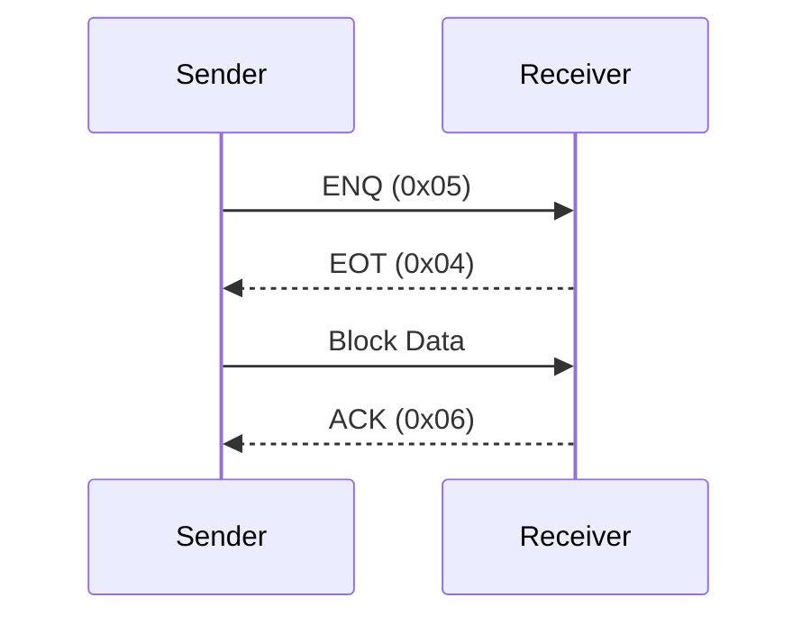

# SECS-I State Machine & Handshake

This document details the SECS-I protocol state machine, including handshake sequences, timeouts, and error handling.

## 1. Handshake Sequence

The standard block transfer involves a handshake to ensure the receiver is ready.

### Standard Flow:
1.  **Sender (Idle)**: Wants to send a block.
2.  **Sender**: Sends `ENQ` (0x05).
3.  **Receiver**: Receives `ENQ`. Checks if ready.
4.  **Receiver**: Sends `EOT` (0x04) to signal readiness.
5.  **Sender**: Receives `EOT`. Sends the **Block** (Length + Header + Body + Checksum).
6.  **Receiver**: Receives Block.
    *   Validates **Length Byte** (Must be `10 <= N <= 254`).
    *   Validates **Checksum**.
7.  **Receiver**:
    *   **Valid**: Sends `ACK` (0x06).
    *   **Invalid**: Sends `NAK` (0x15).

### Diagram:

## 2. Timeouts

The protocol relies on four key timeouts to detect communication failures.

| Timeout | Name | Typical Value | Description |
| :--- | :--- | :--- | :--- |
| **T1** | Inter-Character | 0.5s | Max time between receiving individual characters of a block. |
| **T2** | Protocol | 10s | Max time to wait for a handshake response (`EOT` or `ACK`). |
| **T3** | Reply | 45s | Max time to wait for a Reply Message (Secondary) after sending a Primary Message. |
| **T4** | Inter-Block | 45s | Max time to wait for the next block of a multi-block message. |

### Usage in State Machine:

*   **T1 (Receiver)**:
    *   Timer starts after `Length Byte` is received.
    *   Reset after each subsequent byte.
    *   If expires, send `NAK`.

*   **T2 (Sender/Receiver)**:
    *   **Sender**: Starts after sending `ENQ`. If `EOT` not received within T2 -> **Retry**.
    *   **Sender**: Starts after sending **Second Checksum Byte**.
        *   If no character received within T2 -> **Retry**.
        *   If non-ACK character received -> **Retry**.
    *   **Receiver**: Starts after sending `EOT`.
        *   If `Length Byte` not received within T2 -> Send `NAK`, abort receive.

## 3. Retry Mechanism (RTY)

If a send failure occurs, the sender increments a retry counter.

*   **Parameter**: `RTY` (Retry Limit, typically 3).
*   **Triggers for Retry**:
    1.  Time between sending `ENQ` and receiving `EOT` > T2.
    2.  Time between sending 2nd Checksum and receiving *any* char > T2.
    3.  Received a non-ACK character after sending 2nd Checksum.
*   **Logic**:
    1.  If error occurs, `RetryCount++`.
    2.  If `RetryCount <= RTY`: Restart handshake from `ENQ`.
    3.  If `RetryCount > RTY`: Declare **Send Failure** (Alarm/Error), notify Application.

## 4. Contention Resolution

Contention occurs when both Host and Equipment try to send `ENQ` simultaneously.

*   **Master (Equipment)**: Has priority.
    *   After sending `ENQ`, it **ignores all characters except EOT**.
    *   Effectively, it treats the incoming `ENQ` as noise and continues waiting for its `EOT`.
*   **Slave (Host)**: Yields.
    *   If it sends `ENQ` and receives `ENQ` (Contention detected):
    *   It **ignores all characters except ENQ or EOT**.
    *   Stops sending (postpones its block).
    *   Sends `EOT` (accepts Master's request).
    *   Transition to **Receive State**.
    *   After receiving Master's block, it retries its own Send from the beginning (`ENQ`).

## 5. Receive Completion Logic

Receiver behavior upon finishing block reception:

*   **Valid Block**:
    *   Send `ACK`.
    *   Notify Message Protocol.
*   **Invalid Block** (Length Verification Failed OR Checksum Mismatch):
    *   **Crucial Step**: Continue to listen for characters to drain the line.
    *   **Logic**: Reset timer `t=0` upon receiving any char.
    *   Wait until **T1** expires (Line is silent for T1).
    *   Send `NAK`.
    *   **Discard** any data received for this block.
